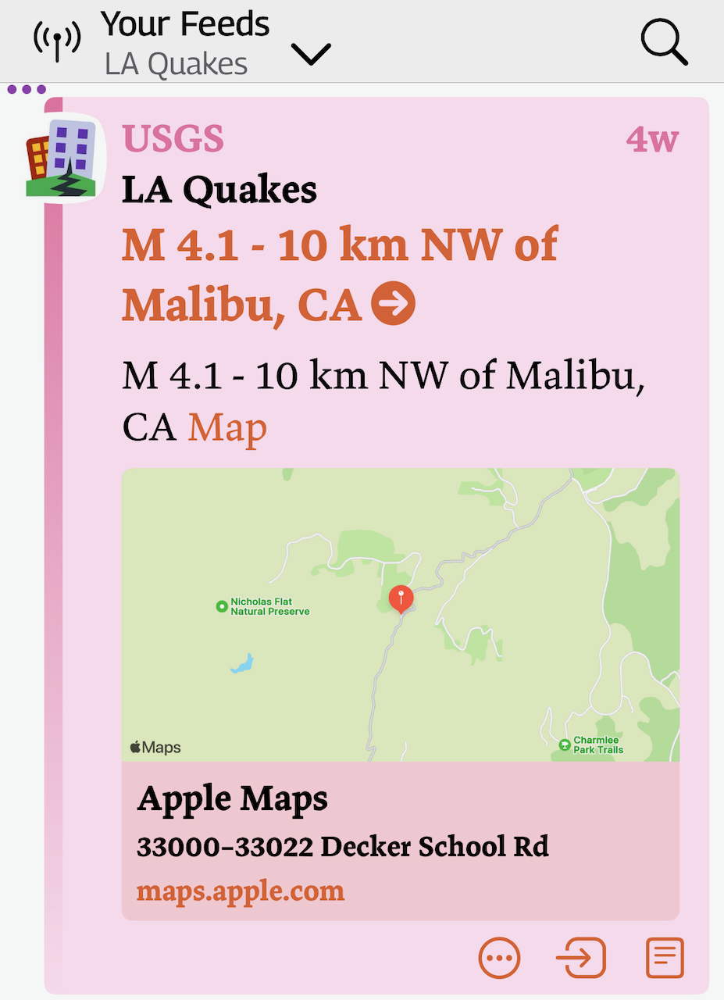

Using earthquake data from [U.S. Geological Survey USGS](https://www.usgs.gov/) connect to the USGS [Query API](https://earthquake.usgs.gov/fdsnws/event/1/) and find recent earthquakes within the radius provided of the provided latitude and longitude having at least the magnitude provided.

