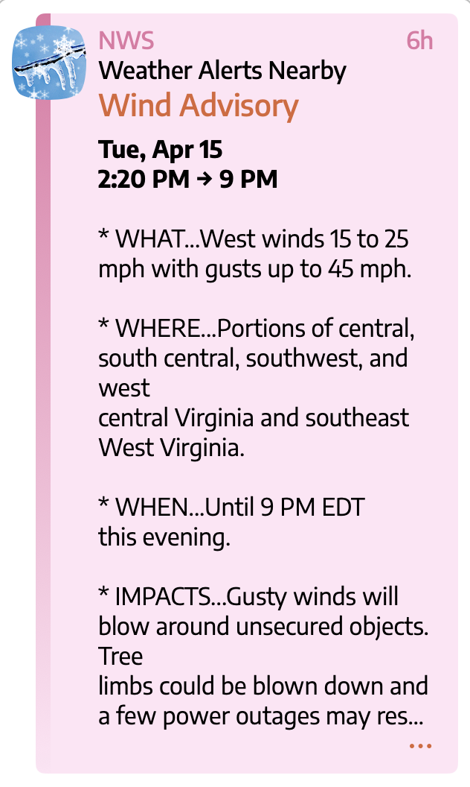

Using weather forecast and alert data from [National Weather Service NWS](https://www.weather.gov/) connect to the NWS [Alert API](https://www.weather.gov/documentation/services-web-api) and find active weather alerts covering the provided latitude and longitude.

